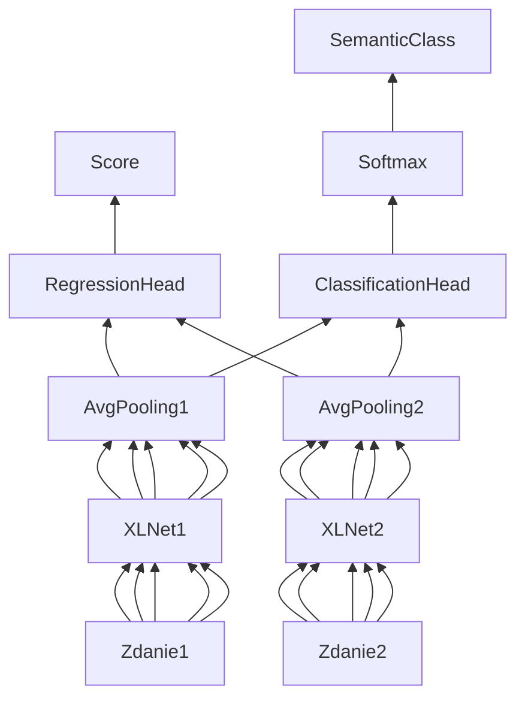

# [NLP] Dokumentacja końcowa

## Zespół

* Rafał Kulus (300249)
* Jakub Strykowski (300516)
* Michał Szaknis (300274)

## Pierwotny temat projektu

Modyfikacja modelu (np. XLNet, RoBERTa) przystosowanego do określania podobieństwa semantycznego (iSTS - https://alt.qcri.org/semeval2016/task2/) dwóch zdań w języku angielskim. Odniesienie się do wyników z obronionej pracy magisterskiej/projektu. 2-3 os.

Wersja **a)**:

1. Modyfikacja modelu XLNet_M przystosowanego do iSTS poprzez wprowadzenie regresji dla oceny podobieństwa. Obecny model korzysta z klasyfikacji.
2. Dodatkowo wprowadzenie łącznego uczenia (jedna funkcja kosztu) dla wyznaczania oceny i typu.
3. Porównanie 1 i 2 z pracą magisterską/projektem.

## Problemy

W trakcie pracy nad projektem okazało się, że model XLNet_M (XLNet_Mazur_20z) ma wiele problemów.

Po pierwsze wspomniany model korzysta z już spreparowanych danych, które nie były dołączone do projektu, a udało się je znaleźć w projekcie XLNet_Grudkowski_Wiaderek_21l. Dane te były w następującym formacie:

```
x1	x2	y_type	y_score
both	Bulbs A and C	5	5
have	are	5	5
still	still	5	5
```

W powyższych danych typ jest oznaczony przez wartość z zakresu 1--5, typy SPE1 i SPE2 są oznaczone wartością 3 (utrata informacji), a ponad to plik zawiera tylko pary chunków, które były zalignowane. Chunki, dla których nie znaleziono pary, zostały pominięte (typy NOALI i ALIC).

Po głębszej analizie, gdy próbowaliśmy zmapować wartości liczbowe na konkretne typy poprzez porównywanie danych w powyższym pliku z danymi w pliku `.wa` okazało się, że kolumny `y_type` i `y_score` są zamienione miejscami.

Nie byliśmy też w stanie stwierdzić, w jaki sposób Mazur wyliczał F1 score, ponieważ format, w jakim jego kod zapisywał predykcje, nie pasował ani do formatu, którego oczekiwały pliki perlowe dołączone do oryginalnego zadania, ani pythonowy odpowiednik w projekcie Grudkowskiego. W dokumentacji również nie znaleźliśmy tej informacji.

Po analizie kodu Mazura okazało się też, że już korzysta z regresji dla scora, a nawet dla typu! W dodatku jego rozwiązanie wykorzystywało bibliotekę Hugging Face do tego stopnia, że nie było możliwe zwykłe zmodyfikowanie jego rozwiązania, aby wykonać nasze zadanie.

W efekcie musieliśmy napisać własne rozwiązanie, które nie ma żadnego związku z projektem Mazura. Z tego też względu **postanowiliśmy od razu zaimplementować razem punkty 1 i 2 z tematu projektu i nie porównywać wyników naszego modelu z wynikami Mazura, ponieważ oba rozwiązania nie mają ze sobą nic wspólnego.**

## Studia literaturowe

Semantyka pochodzi od greckiego słowa gr. σημαντικός, sēmantikós – „ważny”, „znaczący” jest to dział językoznawstwa, który odpowiada za analizę znaczenia wyrazów. W tej pracy poświęciliśmy uwagę zagadnieniu Interpretable Sematic Textual Similarity (iSTS), tłumacząc na polski Interpretowane Podobieństwo Semantyczne. Problemem jaki rozwiązuje iSTS jest porównanie podobieństwa dwóch zadań w języku angielskim oraz określenie stopnia ich podobieństwa. iSTS dzieli na kawałki podane zdania, porównuje je między sobą i zwraca wartość odpowiedzialną za skalę podobieństwa.

Do celu tej pracy możliwe jest użycie kilku dostępnych rozwiązań np. Google BERT, Facebook RoBERTa lub XLNet. BERT oznacza "Bidirectional Encoder Representations from Transformers". Powstał dzięki zaangażowaniu inżynierów z Googla i jest wykorzystywany szeroko do NLP. W kontekście przetwarzania języka naturalnego słowo Transformer oznacza model do deep learningu, który przyporządkowuje wagi analizowanym informacjom wejściowym. Dostępne modele mają swoje wady oraz zalety, ale są zbliżone do siebie.

**Porównanie dostępnych rozwiązań**


## Literatura

Ważniejsze artykuły:

https://alt.qcri.org/semeval2015/task2/index.php?id=proba

https://towardsdatascience.com/multi-label-text-classification-with-xlnet-b5f5755302df

Inne artykuły:

https://en.wikipedia.org/wiki/Transformer\_(machine\_learning\_model) 

https://towardsdatascience.com/bert-explained-state-of-the-art-language-model-for-nlp-f8b21a9b6270

https://towardsdatascience.com/bert-roberta-distilbert-xlnet-which-one-to-use-3d5ab82ba5f8

https://towardsdatascience.com/multi-label-text-classification-with-xlnet-b5f5755302df

Dokumentacje bibliotek:

https://pytorch.org/docs/stable/index.html

https://pytorch-lightning.readthedocs.io/en/latest/

https://huggingface.co/docs

## Opis rozwiązania

Na wejściu otrzymujemy sekwencje tokenów (chunki, kawałki zdań), które mamy poddać ocenie podobieństwa i sklasyfikować. Do tego celu na każdym tokenie stosujemy XLNet, który generuje nam zembeddowany wektor. Następnie stosujemy AveragePooling w celu połączenia wynikowych wektorów stanu w jeden, który potem wykorzystujemy do zasilenia jednowarstwowych perceptronów realizujących zadanie regresji (dla scora) i klasyfikacji (dla klasy).



### Łączna funkcja kosztu

Aby uzyskać łączną funkcję kosztu oraz uczenie podczas trenowania liczymy oddzielnie stratę dla `RegressionHead` stosując mean squared error (MSE), a następnie stratę dla `ClassificationHead` za pomocą binary cross-entropy with logits (BCEWithLogits). Po wyliczeniu strat dodajemy je i resztą zajmuje się biblioteka PyTorch Lightning. Podczas dodawania Tensorów sumie nie ulega tylko ich wartość, ale również przypisany do każdego wektora graf pochodnych, który jest potem wykorzystywany przez optymalizator.

## Implementacja

Środowisko: **Google Colab**
Język: **Python**
Biblioteki: **PyTorch, PyTorch Lightning, Hugging Face**

Całość rozwiązania została zaimplementowana w postaci notebooka na Google Colab. Notebook zaciąga potrzebne dane z naszego repa na GitHubie (https://github.com/L0czek/Mazury), dzięki czemu nie trzeba za każdym razem ręcznie uploadować danych ani wrzucać ich na własnego Drive'a. Na repie znajdują się m.in.:

* skrypty perlowe do obliczania F1 score
* oryginalne dane w formacie `.wa`
* przygotowane przez nas dane w formacie przyjaznym dla naszego modelu
* skrypt konwertujący dane z formatu `.wa` na nasz własny
* skrypt konwertujący predykcje do formatu `.wa` 

Do wizualizacji uczenia się modelu wykorzystujemy platformę wandb.ai, pod którą jest podpięty notebook. Wykorzystujemy też fakt, że w Colabie dostępny jest interpreter perla, dzięki czemu po zakończeniu uczenia i dokonaniu predykcji, pliki perlowe do obliczenia F1 score uruchamiane są bezpośrednio w notebooku.

Zadbaliśmy też o parametryzację kodu. Wykorzystaliśmy w tym celu różnego rodzaju inputy, które oferuje Colab. Jeśli gdzieś jest jakaś zmienna, której użytkownik mógłby chcieć zmienić wartość, będzie do niej podpięty np. slider, checkbox, dropdown lub text input. Warto zaznaczyć, że ta funkcjonalność nie działa w Jupyter Notebooku.

## Instrukcja obsługi

Należy dołączony notebook wrzucić do Google Colaba i odpalić. Potrzebne dane powinny zostać zaciągnięte z repo. Gdyby jednak repo przestało istnieć, należy dołączone repo wrzucić na np. GitHuba i podmienić link w odpowiednim miejscu.

Wykonywanie może zostać wstrzymane i użytkownik zostanie poproszony o klucz do wandb.ai. W takiej sytuacji należy utworzyć konto na platformie lub zalogować się, skopiować klucz i wkleić go do inputu w notebooku, który się wyświetli. Można też pozbyć się wszelkich odwołań do wandb.ai z notebooka, jeśli użytkownik nie chce korzystać z tej platformy w celu logowania postępów uczenia się modelu.

## Testy

W momencie ładowania datasetu treningowego jest on przez data loader dzielony losowo w stosunku 8:2 na zbiór treningowy i walidacyjny. Do wykonywania predykcji i obliczania F1 score używany jest dataset testowy, który nie bierze udziału w uczeniu się modelu.

Początkowo skupiliśmy się na doborze odpowiedniego learning rate'u, ponieważ nasz model z domyślnymi parametrami dla optymalizatora AdamW (lr=0.001) uczył się tak tragicznie, że nie mieliśmy serca pozwolić mu kontynuować nauki. Loss oscylował w okolicy wartości 5.

Przeprowadziliśmy pełne uczenie (10 epok) dla datasetu answers-students z lr na poziomie 1e-4, 5e-5 i 1e-5. Ostatecznie ostatnia wartość okazała się najskuteczniejsza, jednak różnice między 5e-5 i 1e-5 były tak znikome, że nie przeprowadzaliśmy uczenia dla mniejszych wartości. Dla wspomnianych wartości loss był w okolicach 1.

Następnie przeprowadziliśmy uczenie i dokonaliśmy predykcji dla pozostałych dwóch datasetów z lr=1e-5.

Nie bawiliśmy się w dostrajanie pozostałych parametrów optymalizatora (np. weight decay), ponieważ uzyskaliśmy zadowalające rezultaty, a wystarczająco dużo czasu wypaliło nam analizowanie projektu Mazura. Jednakże uważamy, że z naszego modelu można wycisnąć jeszcze więcej.

Ponieważ wyniki zwrócone przez skrypty `evalF1_penalty.pl` i `evalF1_no_penalty.pl` różnią się tylko dla metryki `F1 Typ+Sco`, pozostałe metryki zostały zapisane tylko raz, by nie duplikować informacji i zachować przejrzystość.

**Wyniki dla datasetu answers-students z różnymi learning rate'ami**

|                             |        |        |        |
| --------------------------- | ------ | ------ | ------ |
| **Learning rate**           | 1e-4   | 5e-5   | 1e-5   |
| **F1 Ali**                  | 1.0000 | 1.0000 | 1.0000 |
| **F1 Type**                 | 0.6132 | 0.6157 | 0.6157 |
| **F1 Score**                | 0.8867 | 0.9027 | 0.8961 |
| **F1 Typ+Sco (penalty)**    | 0.6702 | 0.7132 | 0.7139 |
| **F1 Typ+Sco (no penalty)** | 0.5616 | 0.6088 | 0.6110 |

**Ostateczne wyniki z learning rate wynoszącym 1e-5**

|                             |          |        |           |
| --------------------------- | -------- | ------ | --------- |
| **Dataset**                 | ans-stud | images | headlines |
| **F1 Ali**                  | 1.0000   | 1.0000 | 1.0000    |
| **F1 Type**                 | 0.6157   | 0.5113 | 0.5619    |
| **F1 Score**                | 0.8961   | 0.8659 | 0.8780    |
| **F1 Typ+Sco (penalty)**    | 0.7139   | 0.7472 | 0.7119    |
| **F1 Typ+Sco (no penalty)** | 0.6110   | 0.4950 | 0.5229    |

### Uczenie się modelu w wandb.ai

Poniższe wykresy przedstawiają loss na zbiorze treningowym i walidacyjnym dla klasy, scora i łączny dla uczenia się modelu na datasecie answers-students z learning rate równym 1e-5. Zastosowano wygładzanie wykresów na poziomie 0.8.


Poniżej to samo, ale z użyciem skali logarytmicznej.


Na powyższych wykresach widać, że model uczył się przez pierwsze 4 epoki i później nie był w stanie już nic więcej się nauczyć. Prawdopodobnie należałoby się pobawić innymi parametrami optymalizatora niż tylko learning ratem.

### Porównanie z rozwiązaniami dotychczasowymi

Nie wiedzieliśmy, czy score w podtabeli *F1 score+type* jest wynikiem dla *penalty* czy *no penalty*, a zatem zduplikowaliśmy podtabelę i uzupełniliśmy obie z nich różnymi wartościami (do wyboru do koloru). Ponadto zastosowaliśmy formatowanie warunkowe w celu łatwiejszej wizualizacji i porównywania wyników. Arkusz z wynikami w formie edytowalnej / kopiowalnej znajduje się w załączonym repo.


## Wnioski

Masę czasu straciliśmy na analizowaniu i próbie modyfikacji projektu Mazura, ponieważ nasz projekt miał bazować na jego projekcie. Ostatecznie całkowicie z tego zrezygnowaliśmy, ponieważ nie wiadomo, skąd były brane dane, które w dodatku były uproszczone i błędne, nie wiadomo jak był liczony F1 score, nie dało się też w prosty sposób zmodyfikować modelu ze względu na zastosowane biblioteki, a dokumentacja była napisana bardzo ogólnie bez szczegółów.

Implementując nasz model zadbaliśmy o architekturę, tak aby była czytelna i łatwa w modyfikacji i rozszerzaniu, a także aby przeprowadzanie eksperymentów szło płynnie i bezboleśnie.

Niestety nie byliśmy w stanie poświęcić wystarczającej ilości czasu na dokładne poeksperymentowanie z parametrami modelu i w szczególności optymalizatora. Nasz model bardzo szybko osiąga zadowalające wyniki, a bawiliśmy się jedynie learning ratem. Sądzimy zatem, że z zaimplementowanego modelu można wycisnąć o wiele więcej.

Pomimo że iSTS jest zadaniem trudnym, to mieliśmy do czynienia z przypadkiem uproszczonym, ponieważ operowaliśmy na już podzielonych na zalignowane chunki zdaniach. Z drugiej strony korzystamy z average poolingu na wyjściu XLNeta, a to nie jest zbyt dobre rozwiązanie. Sądzimy, że przy użyciu LSTMa lub GRU można by osiągnąć o wiele lepsze wyniki, gdyż taka architektura pozwoliłaby na wyciągnięcie informacji z zależności między tokenami (skorzystanie z kontekstu).
