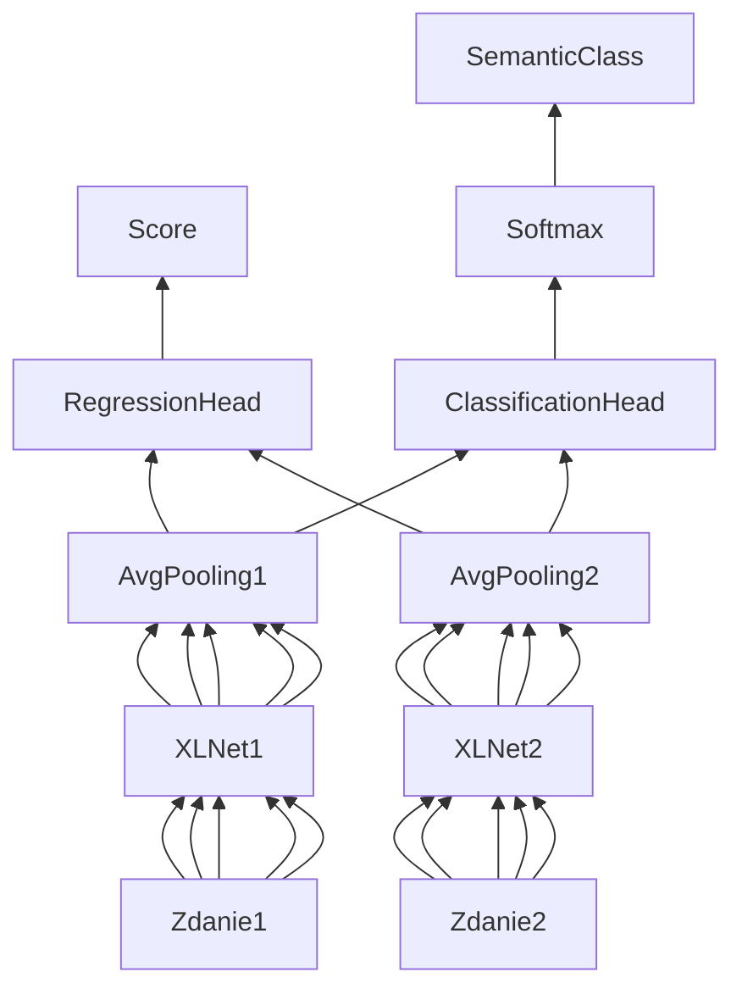

# [NLP] Projekt wstępny

**Zespół**
* Rafał Kulus (300249)
* Jakub Strykowski (300516)
* Michał Szaknis (300274)

**Temat projektu**

Modyfikacja modelu (np. XLNet, RoBERTa) przystosowanego do określania podobieństwa semantycznego (iSTS - https://alt.qcri.org/semeval2016/task2/) dwóch zdań w języku angielskim. Odniesienie się do wyników z obronionej pracy magisterskiej/projektu. 2-3 os.

Wersja **a)**:

1. Modyfikacja modelu XLNet_M przystosowanego do iSTS poprzez wprowadzenie regresji dla oceny podobieństwa. Obecny model korzysta z klasyfikacji.
2. Dodatkowo wprowadzenie łącznego uczenia (jedna funkcja kosztu) dla wyznaczania oceny i typu.
3. Porównanie 1 i 2 z pracą magisterską/projektem.

## Wstęp teoretyczny

Semantyka pochodzi od greckiego słowa gr. σημαντικός, sēmantikós – „ważny”, „znaczący” jest to dział językoznawstwa, który odpowiada za analizę znaczenia wyrazów. W tej pracy poświęcimy uwagę zagadnieniu Interpretable Sematic Textual Similarity (iSTS), tłumacząc na polski Interpretowane Podobieństwo Semantyczne. Problemem jaki rozwiązuje iSTS jest porównanie podobieństwa dwóch zadań w języku angielskim oraz określenie stopnia ich podobieństwa. iSTS dzieli na kawałki podane zdania, porównuje je między sobą i zwraca wartość odpowiedzialną za skalą podobieństwa.

Do celu tej pracy możliwe jest użycie kilku dostępnych rozwiązań np. Google BERT, Facebook RoBERTa lub XLNet. BERT oznacza "Bidirectional Encoder Representations from Transformers". Powstał dzięki zaangażowaniu inżynierów z Googla o jest wykorzystywany szeroko do NLP. W kontekście przetwarzania języka naturalnego słowo Transformer oznacza model do deep learningu, który przyporządkowuje wagi analizowanym informacjom wejściowym. Dostępny modele mają swoje wady oraz zalety, ale są zbliżone do siebie.

**Porównanie dostępnych rozwiązań**

https://en.wikipedia.org/wiki/Transformer_(machine_learning_model) 

https://towardsdatascience.com/bert-explained-state-of-the-art-language-model-for-nlp-f8b21a9b6270

https://towardsdatascience.com/bert-roberta-distilbert-xlnet-which-one-to-use-3d5ab82ba5f8

https://towardsdatascience.com/multi-label-text-classification-with-xlnet-b5f5755302df

## Schemat modelu

Na wejściu otrzymujemy sekwencje tokenów (chunks, kawałków zdań), które mamy poddać ocenie podobieństwa i sklasyfikować. Do tego celu możemy na każdym tokenie zastosować XLNet, który wygeneruje nam zembeddowany wektor. Następnie możemy zastosować np. AveragePooling w celu połączenia wynikowych wektorów stanu w jeden, który potem wykorzystamy do zasilenia jednowarstwowych perceptronów realizujących zadanie regresji i klasyfikacji.

## Łączna funkcja kosztu

Aby uzyskać łączną funkcję kosztu oraz uczenie wystarczy podczas trenowania policzyć oddzielnie stratę dla `RegressionHead` stosując np. mean squared error (MSE), a następnie stratę dla `ClassificationHead` np. za pomocą binary cross-entropy (BCE). Po wyliczeniu strat wystarczy je dodać i resztą zajmie się biblioteka PyTorch. Podczas dodawania Tensorów sumie nie ulega tylko ich wartość, ale również przypisany do każdego wektora graf pochodnych, który jest potem wykorzystywany przez optymalizator.

## Środowisko implementacji

Python z użyciem m.in. biblioteki PyTorch i Hugging Face w środowisku Google Colab.

